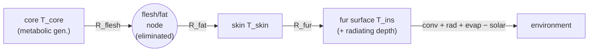

# Radial layer model — mapping the current heat balance

**Purpose.** Step 1 of the radial-layer redesign: express the *current* per-part
heat balance as an explicit node/flux network, so we can judge whether the layered
abstraction is as clean as it looks *before* touching the solver. No code changes
here — this is the map we measure the redesign against.

The claim we're testing: the body's radial structure (core → flesh → fat → fur →
environment) is a 1-D conduction network, the same shape of problem the compartment
solve already generalises *laterally* across parts. If true, "naked", "a second
flesh shell for a large animal", and "clothing over fur" are all just *node counts*,
not code paths.

---

## 1. The current model is already a radial network — analytically collapsed

`net_metabolic_heat` (net_metabolic_heat.jl) computes core→skin conduction as a
**series of two radial resistors**, flesh then fat, with the flesh/fat boundary node
already eliminated (series resistance = sum). For a cylinder:

```
metabolic = (T_core − T_skin) / (R_flesh + R_fat)
R_flesh = r_flesh² / (4·k_flesh·V)                       # distributed generation (Poisson)
R_fat   = r_flesh² / (2·k_fat·V) · log(r_skin / r_flesh) # cylindrical shell
```

`R_flesh`'s `r²/4kV` form is the analytic solution of the radial conduction PDE with
**uniform heat generation through the flesh volume** — not a plain resistor. `R_fat`
is a passive cylindrical shell `∝ log(r_out/r_in)`. The fur is a third such shell
(`k_ins / log(r_insulation/r_skin)`, radiant_temperature.jl:113-117).

So the physics is a radial chain that has been solved in closed form:



## 2. Node / flux inventory (what's actually there)

**Temperature nodes** (decision variables in the NLP form):

| Node | Symbol | Status today |
|---|---|---|
| Core | `core_temperature` | regulated (setpoint / solved) |
| Flesh/fat boundary | — | **eliminated** (folded into `R_flesh+R_fat`) |
| Skin | `skin_temperature` | variable |
| Fur outer surface | `insulation_temperature` | variable |
| Fur radiating depth | `radiant_temp` | derived (at optical depth `r_skin + f·depth`) |
| Ground-compressed fur | `compressed_insulation_temperature` | derived (only if `conduction_fraction>0`) |

**Interfaces / conductances:**

| Interface | Conductance | Source |
|---|---|---|
| core → skin (flesh) | `4k_flesh·V/r²` + distributed generation | net_metabolic_heat |
| flesh → skin (fat) | `2k_fat·V / (r²·log(r_skin/r_flesh))` | net_metabolic_heat |
| skin → fur surface | `k_ins / log(r_ins/r_skin)` (uncompressed) | radiant_temperature |
| skin → ground (compressed fur) | `k_comp / log(r_comp/r_skin)` · `conduction_fraction` | radiant_temperature |
| fur → env | convection + linearised radiation (T³) | solve_part_heat_balance |

**Node source / boundary fluxes:**

| Node | Sources |
|---|---|
| Core | + metabolic, − respiration (at lung) |
| Flesh | distributed metabolic generation (the r²/4kV term) |
| Skin | − skin evaporation |
| Fur surface | + solar (through optical depth), − insulation-surface evaporation, − convection, − radiation |

## 3. Where it's already clean (the abstraction holds)

- **Flesh + fat are series radial resistors.** Un-collapsing them (keeping the
  flesh/fat node, or splitting flesh into shells) is pure discretisation — the
  1-shell case must reproduce `net_metabolic_heat`. This is exactly "a second flesh
  layer for a large animal": more shells, distributed generation across them.
- **Fur is a cylindrical-shell conductance** `k/log(r_out/r_in)` — a radial layer by
  construction. Adding a second fur/clothing layer is another shell in series.
- **Bare skin already degenerates** (`insulation_properties`: zero fur conductivity →
  the fur shell vanishes). Naked = drop the fur node.

## 4. Where the abstraction leaks (the honest part)

These are the three things that make it *not* a pure series stack, and they're where
the real design decisions live:

1. **Skin is written as an *average of two estimates*, not a node balance**
   (`mean_skin_temperature`): `calc1 = T_core − flow·(R_flesh+R_fat)` (core side) and
   `calc2 = flow·R_fur + T_fur` (environment side), then `T_skin = (calc1+calc2)/2`.
   In a real conduction network the skin node is fixed by flux continuity alone.

   **Measured (2026-08): this is a clarity smell, not a correctness one.** The
   iterative solver updates `guess ← calc1` and only accepts convergence when
   `|guess − mean| < tol`, which at its fixed point equals `|calc1 − calc2|/2` — so it
   structurally drives the two estimates together. Instrumenting `mean_skin_temperature`
   and running the iterative solve across 0.1–100 kg, with/without ground contact
   (`conduction_fraction` 0.0 and 0.3 — both branches) and under evaporative stress
   (`skin_wetness = 0.5`), gives `|calc1 − calc2| ≈ 1e-13 K` (machine epsilon) in every
   case, converging on the first pass. So `T_skin = mean = calc1 = calc2` is the true
   flux-continuity value; the average is just an unusual way of writing the node
   balance. A node-balance reformulation reproduces today's numbers here — **no test
   baselines move on this account.** (Caveat: the solver returns `success` even at
   `ntry = 20`; a genuinely non-converging case could return `calc1 ≠ calc2`, but none
   of the regimes tested hit that — it's a solver-robustness point, separate from the
   averaging.)

2. **Ground contact is a parallel branch, not a series layer.**
   `conduction_fraction` splits the fur into a free path (skin → fur surface → air)
   and a compressed path (skin → compressed fur → substrate), in **parallel**
   (`conductances.total = compressed + uncompressed`). So the skin node has *two*
   outward branches — the network has a lateral fork, not a single chain. A layer
   list alone can't express this; we need either a second "surface" node (ground) or
   an explicit parallel-branch concept.

   **Measured (2026-08, 1 kg cylinder, cold sky 263 K / warm substrate 300 K): a
   first-class path, not a perturbation.** Fraction of non-evaporative heat loss
   through the ground branch: `conduction_fraction=0.1 → 8%`, `0.3 → 26%`,
   `0.5 → 45%`; the compressed-fur surface runs ~0.8–0.9 K above the free-fur surface.
   The redesign **must** carry ground contact as a real branch (a substrate node off
   the skin node) — this is a required feature, not a correction. It's the compartment
   coupling idea applied radially.

3. **Radiation and solar act at an optical *depth* inside the fur, coupled to
   conduction** (`radiant_temp` at `r_skin + longwave_depth_fraction·depth`), not at
   a clean outer surface. `radiant_temperature` is one big closed form precisely
   because conduction and radiation-at-depth are solved together.

   **Measured (2026-08): dormant by default, and structurally fragile when enabled.**
   Every example/test uses `longwave_depth_fraction = 1.0` (traits.jl:275,
   examples.jl:179), i.e. radiation *at the outer surface* — `radiant_temp =
   insulation_temp`, gap `= 0`, so the depth coupling never fires. And it can't safely:
   the closed form divides by `log(r_insulation/r_radiation)` (cylinder) /
   `(r_insulation − r_radiation)` (sphere), which → 0 as the radiating depth
   approaches the surface — the code itself flags the `ldf = 1` singularity
   (radiant_temperature.jl:322) and sidesteps it with a special-case branch. For the
   example's 2 mm fur, *any* `ldf < 1` sits so close to that singularity that the
   solve runs away to non-physical states (insulation surface > 400 K). So radiation
   -at-depth is both off-by-default and unusable-when-on in the current form. A
   discretised fur turns it into a clean radiative source on an interior shell node —
   **no singularity** — so the redesign *reproduces* the default (surface radiation,
   trivially) and *gains* a depth-radiation capability that doesn't currently work.

Plus: every formula is **shape-dispatched** (cylinder / sphere / ellipsoid have
different radial-area weightings). The per-interface conductance must come from the
shape family — which the codebase already dispatches, so this is mechanism we have.

## 5. The target shape

An ordered list of shells; each interface carries a conductance (conductive, plus a
radiative term for fur), each node a flux-balance residual, with distributed
generation in flesh and radiation/solar as node source terms:

```
nodes:      core · [flesh shells…] · skin · [fur/clothing shells…] · surface
interfaces: conductance_i (conductive [+ radiative])       ← shape-dispatched, radial
sources:    metabolic gen (flesh), solar (fur depth), evaporation (skin, surface)
boundary:   convection + radiation at the outer node (the one nonlinear node)
lateral:    ground-contact branch off the skin node (parallel path to substrate)
```

- **Naked** = zero fur shells. **Large animal** = N flesh shells. **Clothing/snow** =
  append shells. All one solve, no branch.
- **Solve** = tridiagonal linear conduction + a nonlinear outer boundary (and the
  ground branch). In the NLP form each node temperature is a Flatten-driven decision
  variable with one residual — a direct generalisation of today's hardcoded
  `{skin, insulation}` two-variable structure. Adding a layer becomes a change to the
  *structure*, exactly like adding a part did.

## 5a. Implementation status

**Core→skin conduction: done and wired into production.** The conduction chain is an
ordered stack of `GeneratingCore` (flesh, uniform volumetric generation) + `ConductiveShell`
(fat/fur/…) layers, each contributing a shape-dispatched thermal resistance
(`src/radial_layers.jl`). `net_metabolic_heat` is now a thin wrapper over
`radial_net_metabolic_heat`, and the shape-specific closed forms it replaced are deleted —
so this is the production core→skin path, not an additive experiment. Cylinder, sphere,
slab, and **ellipsoid** (via the equivalent-sphere approximation) are all implemented, and
`ConductiveShell` carries any number of shells. `test/radial_layers.jl` pins the pre-refactor
values (`rtol < 1e-10`) for every shape, with and without fat, so §1's claim is proven in
running code: the old closed form *is* this radial network collapsed.

**Surface solve: unified; the iterative twin is retired.** The rule-based per-part surface
solve for insulated parts now root-finds skin and insulation temperatures on the same
residuals the multipart NLP uses (`surface_balance` + `residual_skin_temperature`), via the
shared `solve_part_heat_balance` primitive (`_solve_temperatures_insulated`). The hand-rolled
iterative `solve_with_insulation!` is gone; the rule-based and NLP paths share one
surface-physics implementation. `solve_part_heat_balance` already *is* the "surface node" an
earlier draft listed as a separate phase — a non-iterative per-part energy balance
(convection + radiation + evaporation + conduction − solar) returning residuals — so no new
node abstraction was needed. The bare-skin path (`solve_without_insulation!`) is kept: the
insulated formulation's `log(r_insulation/r_skin)` conductance factors are singular at zero
insulation. The unified solver balances surface energy exactly where NicheMapR endoR used a
linearised update, so `test/endotherm.jl` agrees with it to ~0.3 % on surface quantities and
~1 % on metabolic-heat-linked flows (regulated core/lung temperatures and geometry still
match to <0.1 %).

**Remaining:**

1. **N-shell generating flesh** — the "second flesh layer for a large animal". The layer
   resistance is trivial (`(r_out²−r_in²)/(n·k·V)`, reducing to `GeneratingCore` at
   `r_in = 0`), but the `Body`/geometry model has no representation of an internal flesh
   boundary (only `flesh_radius` + fat) and nothing needs one yet — so it is blocked on a
   BiophysicalGeometry change, not on this module.
2. **Ground-contact branch** — the substrate node off the skin node (§4.2 measured it at
   8–45 % of loss). Open design decision (§6): a topology change, not gateable by
   reproduction alone.
3. **Discretised radiative source** — radiation as a source term on interior fur shell(s)
   (§4.3). Open design decision (§6): radiation-at-depth vs at the outer node changes the
   physics.

## 6. Open design decisions (what the later phases must settle)

- **Radiation at depth vs at surface.** Keep the optical-depth coupling (distribute
  radiation across fur shells) or move radiation to the outer node? The first is
  faithful; the second is simpler but changes the physics.
- **Ground contact.** Model as a second surface node (skin → substrate branch) so the
  network is a small graph, not a chain — reuses the compartment coupling idea
  radially.
- **Distributed generation.** How metabolic heat spreads across multiple flesh shells
  (uniform per volume reproduces the current lump at N=1).
- **The skin averaging.** Drop it for a true node balance and let the endotherm /
  equivalence suites certify the change — or preserve it if it turns out to encode
  real behaviour.

## 7. Verdict

The **radial conduction chain is clean and already present** — flesh+fat+fur are
series radial resistors, distributed generation and shell conductances included, and
naked already falls out. The abstraction genuinely holds for the conduction skeleton.

The three leaks, now measured, sort cleanly by how much the redesign has to *decide*
vs merely *reproduce*:

- **Skin average (leak 1): reproduce, no decision.** `calc1 = calc2` to ~1e-13 K at
  the solution — it's flux continuity written oddly. A node balance gives identical
  numbers; no baselines move.
- **Ground branch (leak 2): reproduce, but it's a required feature.** 8–45 % of heat
  loss flows through it under ground contact. The redesign must carry a substrate
  branch off the skin node from day one — a small radial *graph*, not a pure chain.
- **Radiation-at-depth (leak 3): reproduce the default, and it's a latent fix.** Off
  by default (`ldf = 1`, surface radiation) and structurally singular when switched
  on, so reproducing today is trivial and the discretised-fur form is strictly better
  (a clean radiative source, no singularity).

So none of the three is a correctness *surprise* that forces test rewrites — leak 1
is numerically identical, leaks 2 and 3 are reproduce-the-default plus new capability.
The target is a **small radial graph**: a conduction chain (core · flesh shells ·
skin · fur shells · surface) with one lateral branch (ground) off the skin node and
radiation/solar as source terms on the fur nodes. Build the chain first, gate it on
the existing 4-interface numbers, then add the ground branch (whose magnitude the
tests already pin) and the discretised radiative source (which supersedes the singular
closed form). The compartment-solve idiom — nodes, conductances, per-node sources —
carries the whole thing; the radial direction is just where it hadn't been applied
yet.
